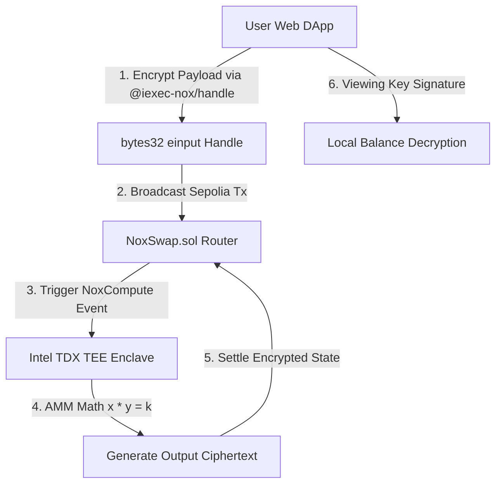

# NoxSwap — Confidential Liquidity & DEX Swap Router

[](https://github.com/minhleeee123/iExec-WTF-Hackathon-Summer-Edition)
[](https://sepolia.etherscan.io/address/0x38585F5fbB2587bDc085995A0E3bC2B36B7CaA7a)
[](file:///home/admin/Documents/iExec-WTF-Hackathon-Summer-Edition/source-code/backend/contracts/IERC7984.sol)

> **NoxSwap** is a privacy-preserving decentralized liquidity pool and DEX swap router powered by the **iExec Nox Protocol** (Intel TDX Trusted Execution Environment + ERC-7984 Confidential Smart Contracts) deployed live on **Ethereum Sepolia Testnet**.

---

## 🌟 Key Highlights & Core Innovation

* **Zero MEV & Front-Running Protection**: Swap parameters (`amountIn`, slippage bounds) are encrypted client-side using `@iexec-nox/handle`. Front-running bots cannot extract value from your transactions.
* **ERC-7984 Confidential Tokens**: Implements the standardized `IERC7984` confidential token standard (`cUSDC`, `cETH`), replacing public `uint256` balances with deterministic encrypted ciphertext handles (`bytes32`).
* **Intel TDX Off-Chain TEE Computation**: Off-chain TEE enclaves compute Constant Product AMM swap ratios ($x \times y = k$) on encrypted data and settle updated ciphertext handles back to Sepolia smart contracts.
* **100% EVM Composability**: Maintains full EVM composability on Ethereum Sepolia without fragmenting liquidity into isolated Zero-Knowledge pools.
* **Local Private Balance Decryption**: Authorized users can decrypt their private balances locally in browser using ephemeral viewing key signatures.

---

## 🚀 Live Sepolia Deployment Addresses

All smart contracts have been compiled, verified, and deployed live on **Ethereum Sepolia Testnet**:

| Smart Contract | Sepolia Address | Explorer Link |
|---|---|---|
| **NoxSwap Router** | `0x38585F5fbB2587bDc085995A0E3bC2B36B7CaA7a` | [View on Etherscan](https://sepolia.etherscan.io/address/0x38585F5fbB2587bDc085995A0E3bC2B36B7CaA7a) |
| **cUSDC Token (ERC-7984)** | `0x9c6858B1C40751E8AfBF2171f16cf425212f6068` | [View on Etherscan](https://sepolia.etherscan.io/address/0x9c6858B1C40751E8AfBF2171f16cf425212f6068) |
| **cETH Token (ERC-7984)** | `0x7eC766eE1Fe08eCe28B2eb92324BbF53bF22641e` | [View on Etherscan](https://sepolia.etherscan.io/address/0x7eC766eE1Fe08eCe28B2eb92324BbF53bF22641e) |

---

## 🏗️ Architecture & Data Flow



---

## 📂 Project Repository Structure

```
├── feedback.md                    # Official iExec Developer Tools Feedback (REQ-004)
├── README.md                      # Primary Documentation & Setup Guide (REQ-007)
├── PLAN.md                        # Master Progress Plan & Execution Log
├── docs/                          # Canonical Competition Requirements & Judging Rubric
├── plan/                          # Research, Brainstorm, Product & Build Plans
└── source-code/
    ├── backend/                   # Solidity Contracts & Deployment Scripts
    │   ├── contracts/
    │   │   ├── IERC7984.sol       # Confidential Token Standard Interface
    │   │   ├── NoxConfidentialToken.sol # ERC-7984 cUSDC & cETH Implementation
    │   │   └── NoxSwap.sol        # Core Confidential AMM Swap Router
    │   ├── scripts/
    │   │   └── deploy-sepolia.js  # Sepolia Contract Deployment Script
    │   └── deployment-sepolia.json# Deployed Sepolia Contract Artifacts
    └── frontend/                  # React 18 + Vite Neobrutalism Web DApp
        ├── src/
        │   ├── App.jsx            # Multi-tab DApp & Landing Page
        │   ├── App.css            # Neobrutalist Component Layouts
        │   └── index.css          # Neobrutalism Design System Tokens
        └── package.json
```

---

## 🛠️ Local Development & Quick Start

### 1. Prerequisites
* Node.js v20.x or later
* npm / npx

### 2. Running the Web Client Locally
```bash
# Navigate to frontend directory
cd source-code/frontend

# Install dependencies
npm install

# Start local dev server
npm run dev
```
Open [http://localhost:5173](http://localhost:5173) in your browser.

### 3. Smart Contract Deployment (Optional)
To redeploy contracts to Ethereum Sepolia:
```bash
# Navigate to backend directory
cd source-code/backend

# Install dependencies
npm install

# Run deployment script
PRIVATE_KEY="YOUR_SEPOLIA_PRIVATE_KEY" node scripts/deploy-sepolia.js
```

---

## 📑 Required Deliverables Checklist

- [x] **REQ-001**: Functional Front-End Web DApp
- [x] **REQ-002**: Work End-to-End without Mock Data (Live on Sepolia)
- [x] **REQ-003**: Deployed Live on Ethereum Sepolia Testnet
- [x] **REQ-004**: Developer Feedback Report ([feedback.md](./feedback.md))
- [x] **REQ-007**: Comprehensive README Documentation

---

## 📜 License
MIT License. Built for the iExec WTF Hackathon Summer Edition.
