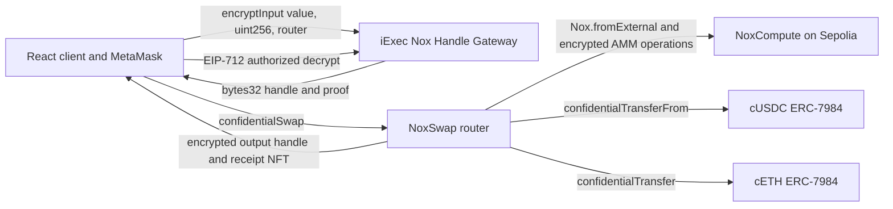

# NoxSwap

NoxSwap is a confidential constant-product swap prototype built with the official iExec Nox Solidity packages and Handle SDK. Inputs, balances, pool reserves, and outputs are represented by Nox `bytes32` handles rather than plaintext token amounts.

The working deployment is on Ethereum Sepolia. It supports faucet, wrap/unwrap, protected encrypted swaps across three pools, authorized balance decryption, selective ACL disclosure, Chainlink-triggered confidential limit orders, a Groq-powered Strategy Agent, event history, and ERC-721 receipts.

The current confidentiality boundaries, privileged roles, public metadata, and
compromise impact are documented in [`docs/threat-model.md`](docs/threat-model.md).

## Live Deployment

Web application: [https://noxswap-iexec.vercel.app](https://noxswap-iexec.vercel.app)

User documentation: [https://noxswap-iexec.vercel.app/docs](https://noxswap-iexec.vercel.app/docs)

| Contract | Sepolia address |
|---|---|
| NoxSwap Router V2 and receipt NFT | [`0x6e8d...1015`](https://sepolia.etherscan.io/address/0x6e8df82d708196e75Fb735120B4817f5c2551015) |
| Confidential limit order book | [`0xab90...96fb`](https://sepolia.etherscan.io/address/0xab903F78edEAF96faE78c0BF46810122fC9896fb) |
| Safe v1.4.1 treasury | [`0x5495...fffF`](https://sepolia.etherscan.io/address/0x549585Be4d75b388B4f825E0bCbBaA85B4FbfffF) |
| Allowlisted Nox Safe module | [`0xc0c6...b093`](https://sepolia.etherscan.io/address/0xc0c60df5F16196944e466E8bD6BE5220F913b093) |
| Safe confidential order book | [`0xd803...9908`](https://sepolia.etherscan.io/address/0xd8037cb70163eC52aa774f54590BB266ee0d9908) |
| cUSDC ERC-7984 wrapper | [`0x6932...28fE`](https://sepolia.etherscan.io/address/0x6932075FBfd847E453992A8A1EEefB6C6cb328fE) |
| cETH ERC-7984 wrapper | [`0x04Dc...D4a4`](https://sepolia.etherscan.io/address/0x04Dc3bebDc4E1dfcB423bB7C38Ed280144B5D4a4) |
| cWBTC ERC-7984 wrapper | [`0x1b8f...8375`](https://sepolia.etherscan.io/address/0x1b8fa85acB318A8599EB2382638020b458028375) |
| cSOL ERC-7984 wrapper | [`0xa7E6...8179`](https://sepolia.etherscan.io/address/0xa7E60411AB2e8683572b260d545507B22bf28179) |
| nUSDC test ERC-20 | [`0x3C03...E68C`](https://sepolia.etherscan.io/address/0x3C03ac1be3c4C30F62aF9f0Cede9ca27A772E68C) |
| nWETH test ERC-20 | [`0x4940...FE07`](https://sepolia.etherscan.io/address/0x494062C2D4558952A2230b60b95269Cb8Ad5FE07) |
| nWBTC test ERC-20 | [`0x2d23...C1EE`](https://sepolia.etherscan.io/address/0x2d23C4617DEDA612166896E7110eaea5ed89C1EE) |
| nSOL test ERC-20 | [`0x6740...595f`](https://sepolia.etherscan.io/address/0x674020dd2C1fB45E26f6e31AC1a7EeceF3E8595f) |
| iExec NoxCompute | [`0x24Ef...77bF`](https://sepolia.etherscan.io/address/0x24Ef36Ec5b626D7DCD09a98F3083c2758F0F77bF) |

The three encrypted pools were initialized in transactions [`0xb509...6ae87`](https://sepolia.etherscan.io/tx/0xb50926c8d71c293e5f13b0f79c46d0f4260b5c4a4301c78fbb34eac96f6ae87b), [`0xdd08...3c72`](https://sepolia.etherscan.io/tx/0xdd08e2eff23401b32b682090162f84dff01e06b3639c37a2bf137d495c3c3c72), and [`0xa650...1f5e`](https://sepolia.etherscan.io/tx/0xa650ae996f1faa9c5d1449154a0c378d6f089f505ec5f53700f0a4f620351f5e). Full addresses and transactions are in [`packages/contracts/deployment-sepolia.json`](./packages/contracts/deployment-sepolia.json).

The original ten NoxSwap deployment contracts have exact creation/runtime source matches on Sourcify. [Inspect the verified Router V2 source](https://repo.sourcify.dev/11155111/0x6e8df82d708196e75Fb735120B4817f5c2551015). The Safe extension addresses and deployment transactions are recorded in the canonical deployment JSON.

All `n*` assets are faucet-backed Sepolia test assets deployed for this demo. They do not represent assets with monetary value or native Solana custody.

## Architecture



The router computes the 0.30% fee and constant-product quote using `Nox.mul`, `Nox.div`, `Nox.add`, and `Nox.sub`. It never receives an output amount from the browser. ERC-7984 wrappers hold the underlying ERC-20 assets and update encrypted balances through the official Nox confidential-contract implementation.

## Implemented Flows

- Faucet `nUSDC` or `nWETH`, subject to a one-hour per-wallet cooldown.
- Wrap public test assets 1:1 into official ERC-7984 wrapper balances.
- Encrypt input amounts with `@iexec-nox/handle` and submit handle plus proof.
- Transfer the encrypted input into the pool and calculate encrypted output from encrypted reserves.
- Encrypt `minOut`; reject and confidentially refund the full input when the quote is insufficient or the public deadline has passed.
- Swap cUSDC/cETH, cWBTC/cUSDC, and cSOL/cUSDC using live encrypted pools.
- Create, execute, cancel, and expiry-refund cUSDC/cETH limit orders with encrypted amount/minOut and a public Chainlink trigger.
- Browse the complete public orderbook without connecting a wallet, with operational status, filters, pagination, shareable URLs, live Chainlink readiness, encrypted handles, and lifecycle transaction links.
- Run permissionless execute/expiry actions manually or through the stateless keeper; only the owner can cancel or reveal private order terms.
- Decrypt only handles authorized for the connected wallet.
- Grant an auditor access to a current balance handle and verify the indexed ACL.
- Unwrap through `UnwrapRequested`, Nox public decryption, and `finalizeUnwrap` proof verification.
- Mint an on-chain ERC-721 SVG receipt for every successful swap.
- Read actual `SwapExecuted` history, calldata, handles, proof size, and receipt metadata.
- Read the Sepolia Chainlink ETH/USD feed for a clearly labeled UI reference estimate.
- Draft a strict limit-order plan from natural language and public Chainlink context; private percentage math and Nox encryption remain in the browser and every transaction still requires MetaMask.
- Select MetaMask, Coinbase Wallet, or Rabby through EIP-6963 provider discovery without falling back to a different injected wallet.
- Configure a 0.5%-10% Chainlink-reference tolerance for swap `minOut` (10% default for the current test-pool/reference basis), then refresh and re-decrypt new balance handles after settlement.
- Revoke an ERC-7984 OrderBook operator authorization for the selected input token; already escrowed orders remain active until settlement or cancellation.
- Fund a Safe-owned ERC-7984 treasury, prepare Nox ciphertext ACLs without spend authority, and settle protected swaps only through the Safe threshold.
- Reveal Safe balance handles to a selected owner/auditor, manage allowlisted token operators, and revoke the Nox module without changing Safe owners or balances.
- Create and cancel confidential limit orders owned by the Safe while minting non-fungible settlement receipts to a verified Safe owner.
- Configure the Safe swap oracle tolerance and deadline, review confirmed Safe events without exposing confidential values, and apply a non-custodial Strategy Agent draft to the Safe order form.
- Unwrap a Safe-owned confidential asset to the Safe or one of its owners through a recoverable request, Nox public-decryption proof, and permissionless finalization.
- Use nine MCP stdio tools for public market/plan reads, real protected swaps, balance decryption, three-pool inspection, ACL inspection, and limit-order management.

## Deliberate Limitations

- AI is not a price oracle or transaction authority. Chainlink and contract rules remain canonical; Groq only drafts reviewable parameters.
- No raw Intel TDX telemetry: the installed Nox client verifies Gateway signatures but exposes no authoritative hardware telemetry API.
- No historical ACL revoke button: the installed Nox SDK supports `addViewer` but not `removeViewer`; grants apply to the current handle and do not automatically carry to a new balance handle.
- No fixed MEV-savings claim. The UI reports measured execution-versus-oracle deviation only for ETH/USDC.
- No LP share/removal lifecycle. Pools are deployer-funded test liquidity.
- The built-in Safe browser signer supports the deployed 1-of-1 demo Safe. Higher-threshold Safes must collect signatures in the Safe Wallet interface.
- Direct faucet claims to the Safe, Safe-owner order execution controls, and in-app multi-owner signature collection are intentionally excluded; funding uses the existing public-wallet faucet followed by wrap-to-Safe, while order execution remains permissionless.

See [`docs/verification.md`](./docs/verification.md) for the remediation and test record.

## Repository Layout

```text
apps/
  web/
    src/
    api/agent/
    scripts/check-ui.mjs
    vercel.json
  keeper/
    src/index.js
    src/keeper-order-index.js
    src/keeper-scanner.js
    src/observer-client.js
  mcp-server/
    src/server.js
    src/strategy-client.js
    bin/noxswap-mcp.js
packages/
  contracts/
    contracts/NoxTestToken.sol
    contracts/NoxConfidentialToken.sol
    contracts/NoxSwap.sol
    contracts/NoxLimitOrderBook.sol
    contracts/NoxSafeModule.sol
    client/abis.js
    scripts/deploy-sepolia.js
    scripts/test-sepolia-e2e.js
    scripts/sync-client-artifacts.js
    deployment-sepolia.json
```

## Run the Web Client

Prerequisites: Node.js 20.19 or newer and npm.

```bash
npm install
npm run dev
```

Open `http://localhost:5173`. The root URL is a standalone landing page; **Launch
app** opens the four-workspace application shell. Trade combines personal swaps and
limit orders, Wallet combines personal asset operations and auditor access, Safe
Treasury provides smart-account-owned balances and allowlisted operations, and
Activity contains personal history plus verification evidence. Private balances
and session controls stay in the desktop sidebar or the mobile wallet drawer.

Safe Treasury is available at `/app/safe` with a compact custody header for Safe
identity, module state, balances, reveal, and funding, followed by URL-addressable
`Swap & unwrap`, `Orders & Agent`, `Activity`, and `Access & security` sections.
The legacy `/app/wallet?tab=safe` URL redirects to the new first-level workspace.

MetaMask must be on Ethereum Sepolia for write operations. Read-only pool and
Chainlink data load without a wallet.

The Strategy Agent is available at `/app/trade?mode=agent`. For local development,
place `GROQ_API_KEY` in the ignored `apps/web/.env.local`; on Vercel,
configure it as a server-side project secret. Never prefix it with `VITE_`, which
would expose it to browser JavaScript. `GROQ_MODEL` defaults to
`openai/gpt-oss-20b`.

The limit-order view is also public and URL-addressable. For example,
`/app/trade?mode=orders&status=executed&order=1` restores its filter and detail
drawer after reload. Set `VITE_SEPOLIA_ARCHIVE_RPC_URL` when the default archive
RPC is unsuitable, and optionally set `VITE_KEEPER_HEALTH_URL` to expose keeper
health in the UI. Neither variable contains a signing key.

The orderbook builds a public index incrementally from lifecycle events and
persists only finalized public metadata. It no longer enumerates every historical
order on each refresh. The keeper uses the same chain-canonical model with a
rebuildable active-order checkpoint; every write still re-reads status and runs
gas simulation immediately before submission.

## Compile and Test

Hardhat 3 and its native EDR dependency require a newer Node runtime than the machine default, so workspace scripts invoke Node 24 through `npx`.

```bash
npm install
npm run compile
npm test
npm run test:nox # requires Docker
npm run keeper:dry
```

Live tests require a funded Sepolia test wallet. Never commit its private key.

```bash
PRIVATE_KEY="YOUR_TEST_WALLET_PRIVATE_KEY" npm run test:sepolia
PRIVATE_KEY="YOUR_TEST_WALLET_PRIVATE_KEY" npm run test:mcp:live
PRIVATE_KEY="YOUR_TEST_WALLET_PRIVATE_KEY" npm run test:mcp:write
npm run verify:sourcify
```

The live E2E signer can be any funded Sepolia wallet; it does not need to be the
deployment owner. Each run writes sanitized JSON evidence under
`packages/contracts/artifacts/evidence/`. The local Nox off-chain Hardhat stack
requires Docker. When Docker is unavailable, the acceptance path is compile plus
unit tests plus the live Sepolia E2E test.

## Stateless Order Keeper

The keeper reads the canonical Sepolia deployment JSON, scans every open order,
rechecks status before submission, and sequentially calls only `executeOrder` or
`expireOrder`. It has no database and never decrypts handles.

```bash
npm run keeper:dry
KEEPER_PRIVATE_KEY="YOUR_TEST_WALLET_PRIVATE_KEY" npm run keeper:once
KEEPER_PRIVATE_KEY="YOUR_TEST_WALLET_PRIVATE_KEY" npm run keeper
```

Polling mode exposes `GET /health` on port `8787` by default and supports an
optional `NOTIFICATION_WEBHOOK_URL`. See
[`apps/keeper/.env.example`](./apps/keeper/.env.example) and
[`apps/keeper/README.md`](./apps/keeper/README.md).
Set `KEEPER_AI_OBSERVER_URL` and `KEEPER_AI_OBSERVER_TOKEN` to the deployed
`/api/agent/observe` endpoint and its shared secret to add keeper-only structured
explanations. The endpoint also enforces a five-request-per-minute client limit
and a bounded request body. Observer output never changes the deterministic keeper
decision and failures do not block settlement.

## MCP Server

```bash
npm run mcp # public read/planning tools; no signing key required
```

Exposed tools:

- `nox_confidential_swap`
- `nox_create_limit_order`
- `nox_decrypt_balance`
- `nox_get_limit_order`
- `nox_get_market_context`
- `nox_manage_limit_order`
- `nox_plan_confidential_order`
- `nox_view_acl`
- `nox_get_pool_handles`

Set `NOXSWAP_AGENT_API_URL` to the deployed `/api/agent/plan` endpoint for the
planning tool. A signer can only decrypt handles for which it has Nox ACL access.
Write tools are disabled by default; enabling them requires both `PRIVATE_KEY` and
`MCP_ALLOW_WRITES=true`. The server contains no fallback private key.

## Redeploy

```bash
npm run compile
PRIVATE_KEY="YOUR_TEST_WALLET_PRIVATE_KEY" npm run deploy:sepolia
```

The current script is an extension deployment: it reuses the original nUSDC/nWETH wrappers, deploys nWBTC/nSOL, four-token Router V2 and the limit-order book, initializes all three encrypted pools, and synchronizes the canonical contracts artifact with the committed web snapshot. It requires the existing deployment owner.

## License

[MIT](./LICENSE)
