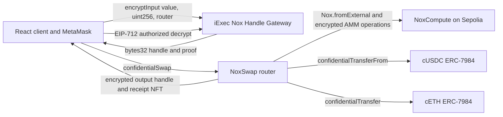

# NoxSwap

NoxSwap is a confidential constant-product swap prototype built with the official iExec Nox Solidity packages and Handle SDK. Inputs, balances, pool reserves, and outputs are represented by Nox `bytes32` handles rather than plaintext token amounts.

The working deployment is on Ethereum Sepolia. It supports the full test flow: faucet, ERC-20 approval, wrap to ERC-7984, encrypted swap, authorized decryption, selective ACL disclosure, unwrap with a public decryption proof, event history, and an ERC-721 receipt.

## Live Deployment

| Contract | Sepolia address |
|---|---|
| NoxSwap router and receipt NFT | [`0x3D96...b0B6`](https://sepolia.etherscan.io/address/0x3D96c59e1d88183834B7FDcF95b51749Eb7ab0B6) |
| cUSDC ERC-7984 wrapper | [`0x6932...28fE`](https://sepolia.etherscan.io/address/0x6932075FBfd847E453992A8A1EEefB6C6cb328fE) |
| cETH ERC-7984 wrapper | [`0x04Dc...D4a4`](https://sepolia.etherscan.io/address/0x04Dc3bebDc4E1dfcB423bB7C38Ed280144B5D4a4) |
| nUSDC test ERC-20 | [`0x3C03...E68C`](https://sepolia.etherscan.io/address/0x3C03ac1be3c4C30F62aF9f0Cede9ca27A772E68C) |
| nWETH test ERC-20 | [`0x4940...FE07`](https://sepolia.etherscan.io/address/0x494062C2D4558952A2230b60b95269Cb8Ad5FE07) |
| iExec NoxCompute | [`0x24Ef...77bF`](https://sepolia.etherscan.io/address/0x24Ef36Ec5b626D7DCD09a98F3083c2758F0F77bF) |

The pool was initialized in [transaction `0xd89f...0e24`](https://sepolia.etherscan.io/tx/0xd89f67ed643bf04c14c7e2e8df552ecd816b7f626b6c0c0bcba5c32a3bed0e24). Full addresses and deployment transaction hashes are in [`source-code/backend/deployment-sepolia.json`](./source-code/backend/deployment-sepolia.json).

All five project contracts have an exact creation/runtime source match on Sourcify. [Inspect the verified NoxSwap source](https://repo.sourcify.dev/11155111/0x3D96c59e1d88183834B7FDcF95b51749Eb7ab0B6).

`nUSDC` and `nWETH` are faucet-backed test assets deployed specifically for this demo. They do not represent real USDC or WETH.

## Architecture



The router computes the 0.30% fee and constant-product quote using `Nox.mul`, `Nox.div`, `Nox.add`, and `Nox.sub`. It never receives an output amount from the browser. ERC-7984 wrappers hold the underlying ERC-20 assets and update encrypted balances through the official Nox confidential-contract implementation.

## Implemented Flows

- Faucet `nUSDC` or `nWETH`, subject to a one-hour per-wallet cooldown.
- Wrap public test assets 1:1 into official ERC-7984 wrapper balances.
- Encrypt input amounts with `@iexec-nox/handle` and submit handle plus proof.
- Transfer the encrypted input into the pool and calculate encrypted output from encrypted reserves.
- Decrypt only handles authorized for the connected wallet.
- Grant an auditor access to a current balance handle and verify the indexed ACL.
- Unwrap through `UnwrapRequested`, Nox public decryption, and `finalizeUnwrap` proof verification.
- Mint an on-chain ERC-721 SVG receipt for every successful swap.
- Read actual `SwapExecuted` history, calldata, handles, proof size, and receipt metadata.
- Read the Sepolia Chainlink ETH/USD feed for a clearly labeled UI reference estimate.
- Use MCP stdio tools for real swaps, balance decryption, pool inspection, and ACL inspection.

## Deliberate Non-Features

The previous prototype displayed several simulated features. They are not presented as working features now:

- No limit-order keeper or automatic limit-order execution.
- No cWBTC or cSOL deployment.
- No AI price model. The UI uses the live Chainlink ETH/USD reference feed.
- No hardware-attestation or real-time enclave telemetry UI.
- No claim that every trade saves a fixed MEV percentage.
- No encrypted `minOut`/deadline or LP share/removal lifecycle yet. Hidden amounts reduce information leakage but do not guarantee immunity from every form of MEV or price manipulation.

See [`source-code/VERIFICATION.md`](./source-code/VERIFICATION.md) for the remediation and test record.

## Repository Layout

```text
source-code/
  backend/
    contracts/NoxTestToken.sol
    contracts/NoxConfidentialToken.sol
    contracts/NoxSwap.sol
    scripts/deploy-sepolia.js
    scripts/test-sepolia-e2e.js
    scripts/test-mcp.js
    mcp-server.js
  frontend/
    src/App.jsx
    src/contracts.js
    src/deployment.json
```

## Run the Web Client

Prerequisites: Node.js 20.19 or newer and npm.

```bash
cd source-code/frontend
npm install
npm run dev
```

Open `http://localhost:5173`. MetaMask must be on Ethereum Sepolia for write operations. Read-only pool and Chainlink data load without a wallet.

## Compile and Test

Hardhat 3 and its native EDR dependency require a newer Node runtime than the machine default, so backend scripts invoke Node 24 through `npx`.

```bash
cd source-code/backend
npm install
npm run compile
npm test
```

Live tests require a funded Sepolia test wallet. Never commit its private key.

```bash
PRIVATE_KEY="YOUR_TEST_WALLET_PRIVATE_KEY" npm run test:sepolia
PRIVATE_KEY="YOUR_TEST_WALLET_PRIVATE_KEY" npm run test:mcp
npm run verify:sourcify
```

The local Nox off-chain Hardhat stack requires Docker. When Docker is unavailable, the acceptance path is compile plus unit tests plus the live Sepolia E2E test.

## MCP Server

```bash
cd source-code/backend
PRIVATE_KEY="YOUR_TEST_WALLET_PRIVATE_KEY" npm run mcp
```

Exposed tools:

- `nox_confidential_swap`
- `nox_decrypt_balance`
- `nox_view_acl`
- `nox_get_pool_handles`

The signer can only decrypt handles for which it has Nox ACL access. The server does not contain a fallback private key.

## Redeploy

```bash
cd source-code/backend
npm run compile
PRIVATE_KEY="YOUR_TEST_WALLET_PRIVATE_KEY" npm run deploy:sepolia
```

The script deploys both faucet tokens, both wrappers, the router, wraps initial liquidity, encrypts the liquidity inputs with the Handle SDK, and writes the resulting addresses to `deployment-sepolia.json`.

## License

MIT
