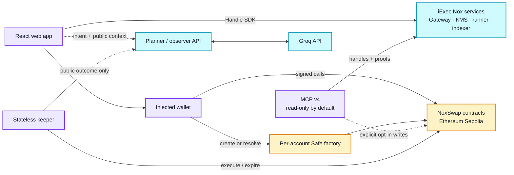
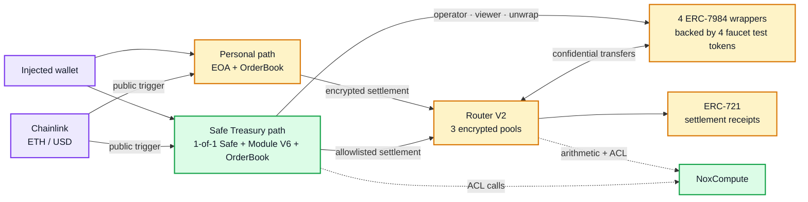

# NoxSwap

[](https://github.com/minhleeee123/iExec-WTF-Hackathon-Summer-Edition/actions/workflows/ci.yml)
[](https://noxswap-iexec.vercel.app)
[](./LICENSE)

NoxSwap is a confidential constant-product swap prototype built with the official iExec Nox Solidity packages and Handle SDK. Inputs, balances, pool reserves, and outputs are represented by Nox `bytes32` handles rather than plaintext token amounts.

The working deployment is on Ethereum Sepolia. It supports four faucet/wrapper
pairs, protected encrypted swaps across three pools, personal and Safe-owned
confidential limit orders, authorized balance decryption, selective ACL
disclosure, a stateless keeper, a Groq-powered Strategy Agent, an opt-in MCP
client, event history, recoverable unwrap, and ERC-721 settlement receipts.

The current confidentiality boundaries, privileged roles, public metadata, and
compromise impact are documented in [`docs/threat-model.md`](docs/threat-model.md).
The canonical UI/UX language and review checklist are documented in
[`DESIGNS.md`](DESIGNS.md).


## Quick Local Start

Prerequisites: Git, npm, and Node.js 22.12 or newer. Node.js 24 is recommended
and used by CI and repository tooling.

```bash
git clone https://github.com/minhleeee123/iExec-WTF-Hackathon-Summer-Edition.git
cd iExec-WTF-Hackathon-Summer-Edition
npm ci
npm run dev
```

Open `http://localhost:5173`. Public Sepolia reads work without a wallet or
secret. Write operations require a supported wallet on Ethereum Sepolia and a
small amount of test ETH.

## Judge Quick Start

| What to inspect | Where / how |
|---|---|
| Live application | [noxswap-iexec.vercel.app](https://noxswap-iexec.vercel.app) |
| Network | Ethereum Sepolia (`chainId` `11155111`) |
| Public proof without a wallet | Open [the live orderbook](https://noxswap-iexec.vercel.app/app/trade?mode=orders) to inspect real lifecycle events, Chainlink readiness, encrypted handles, and Sepolia transaction links. |
| End-to-end confidential trade | Connect MetaMask on Sepolia → claim faucet assets → wrap → submit a protected swap → reveal the authorized encrypted output and receipt. |
| Safe Treasury flow | Open [Safe Treasury](https://noxswap-iexec.vercel.app/app/safe); the connected owner loads its registered treasury or creates a Safe proxy plus restricted Nox module in one transaction. |
| Required Hello World onboarding | Wallet [`0xE412...B64E`](https://sepolia.etherscan.io/address/0xE412d04DA2A211F7ADC80311CC0FF9F03440B64E) deployed the tutorial [`ConfidentialPiggyBank`](https://sepolia.etherscan.io/address/0x3204467cB52e8b8065D52045Ed37094B030fb998) and completed an [encrypted deposit](https://sepolia.etherscan.io/tx/0x1a14157f2edd3d0d2d8317430b0079069fad8cdec58e03b86a4b522cc02da731). Detailed evidence is in [`docs/verification.md`](docs/verification.md#hello-world-onboarding-verification). |
| Demo video | Attach it to the required X submission post before final submission (maximum four minutes). |

No core product data is mocked: public order state comes from Sepolia events and
private values are obtained only through Nox-authorized decryption.

Safe module status is read from Sepolia rather than trusted from the deployment
snapshot. The registered legacy demo Safe's Module V6 passed its live
one-transaction swap at block `11360178` on 2026-07-27 and is that Safe's sole
enabled module. Factory-created owners receive separate Safe and module
addresses. On the same date, the project owner completed the manual Safe V6 test
suite on the production flow, reported that every exercised check passed, and
found the flow noticeably faster than V5.
This qualitative result is consistent with the measured reduction from two
post-encryption transactions to one; no controlled Gateway wall-clock benchmark
is claimed. Owner-controlled module operations are available; permissionless
execution/expiry of existing Safe orders remains independent of the module.

## Live Deployment

Web application: [https://noxswap-iexec.vercel.app](https://noxswap-iexec.vercel.app)

User documentation: [https://noxswap-iexec.vercel.app/docs](https://noxswap-iexec.vercel.app/docs)

| Contract | Sepolia address |
|---|---|
| NoxSwap Router V2 and receipt NFT | [`0x6e8d...1015`](https://sepolia.etherscan.io/address/0x6e8df82d708196e75Fb735120B4817f5c2551015) |
| Confidential limit order book | [`0xab90...96fb`](https://sepolia.etherscan.io/address/0xab903F78edEAF96faE78c0BF46810122fC9896fb) |
| Per-account Safe factory | [`0xdDB5...2B36`](https://sepolia.etherscan.io/address/0xdDB5C64eAa1c69426ad7bed8b98aE9F79B652B36) |
| Registered legacy demo Safe v1.4.1 | [`0x5495...fffF`](https://sepolia.etherscan.io/address/0x549585Be4d75b388B4f825E0bCbBaA85B4FbfffF) |
| Legacy demo Safe's Nox module V6 | [`0x8c17...e8f5`](https://sepolia.etherscan.io/address/0x8c17547b05835b77FeBC5Eb796d4be1a8e73e8f5) |
| Fresh-owner E2E Safe (verification instance) | [`0x961E...F499`](https://sepolia.etherscan.io/address/0x961Ec2DAD6260748Be7F5C170c82E2a227BBF499) |
| Fresh E2E Safe's bound module (verification instance) | [`0x65E2...C178`](https://sepolia.etherscan.io/address/0x65E2b55aB4425eC78e7541B81C1C661C7473C178) |
| Safe confidential order book | [`0xd803...9908`](https://sepolia.etherscan.io/address/0xd8037cb70163eC52aa774f54590BB266ee0d9908) |
| cUSDC ERC-7984 wrapper | [`0x6932...28fE`](https://sepolia.etherscan.io/address/0x6932075FBfd847E453992A8A1EEefB6C6cb328fE) |
| cETH ERC-7984 wrapper | [`0x04Dc...D4a4`](https://sepolia.etherscan.io/address/0x04Dc3bebDc4E1dfcB423bB7C38Ed280144B5D4a4) |
| cWBTC ERC-7984 wrapper | [`0x1b8f...8375`](https://sepolia.etherscan.io/address/0x1b8fa85acB318A8599EB2382638020b458028375) |
| cSOL ERC-7984 wrapper | [`0xa7E6...8179`](https://sepolia.etherscan.io/address/0xa7E60411AB2e8683572b260d545507B22bf28179) |
| nUSDC test ERC-20 | [`0x3C03...E68C`](https://sepolia.etherscan.io/address/0x3C03ac1be3c4C30F62aF9f0Cede9ca27A772E68C) |
| nWETH test ERC-20 | [`0x4940...FE07`](https://sepolia.etherscan.io/address/0x494062C2D4558952A2230b60b95269Cb8Ad5FE07) |
| nWBTC test ERC-20 | [`0x2d23...C1EE`](https://sepolia.etherscan.io/address/0x2d23C4617DEDA612166896E7110eaea5ed89C1EE) |
| nSOL test ERC-20 | [`0x6740...595f`](https://sepolia.etherscan.io/address/0x674020dd2C1fB45E26f6e31AC1a7EeceF3E8595f) |
| iExec NoxCompute | [`0x24Ef...77bF`](https://sepolia.etherscan.io/address/0x24Ef36Ec5b626D7DCD09a98F3083c2758F0F77bF) |

The three encrypted pools were initialized in transactions [`0xb509...6ae87`](https://sepolia.etherscan.io/tx/0xb50926c8d71c293e5f13b0f79c46d0f4260b5c4a4301c78fbb34eac96f6ae87b), [`0xdd08...3c72`](https://sepolia.etherscan.io/tx/0xdd08e2eff23401b32b682090162f84dff01e06b3639c37a2bf137d495c3c3c72), and [`0xa650...1f5e`](https://sepolia.etherscan.io/tx/0xa650ae996f1faa9c5d1449154a0c378d6f089f505ec5f53700f0a4f620351f5e). Full addresses and transactions are in [`packages/contracts/deployment-sepolia.json`](./packages/contracts/deployment-sepolia.json).

There is no single global Safe address for new users. The factory is the shared
entry point; each connected owner resolves or creates a different Safe and bound
module. The two fresh E2E rows above are public proof of that flow, not reusable
default custody addresses. Their generated owner key was intentionally discarded.

All thirteen NoxSwap deployment targets submitted by the repository verification
script have exact creation/runtime source matches on Sourcify. Inspect the
verified [Router V2](https://repo.sourcify.dev/11155111/0x6e8df82d708196e75Fb735120B4817f5c2551015),
[Safe Module V6](https://repo.sourcify.dev/11155111/0x8c17547b05835b77FeBC5Eb796d4be1a8e73e8f5),
[per-account Safe factory](https://repo.sourcify.dev/11155111/0xdDB5C64eAa1c69426ad7bed8b98aE9F79B652B36),
and [Safe orderbook](https://repo.sourcify.dev/11155111/0xd8037cb70163eC52aa774f54590BB266ee0d9908)
sources.
The personal orderbook was deployed from the earlier repository revision linked
in the mapping below; the current orderbook source adds the authorized-entry
points used by Safe and therefore is not byte-for-byte identical to that older
personal deployment.
Their addresses, constructor arguments, deployment transactions, creation
bytecode matches, runtime bytecode hashes, and public Sourcify status are also
checked by the read-only `npm run verify:deployment` command.

All `n*` assets are faucet-backed Sepolia test assets deployed for this demo. They do not represent assets with monetary value or native Solana custody.

### Source-to-deployment mapping

Deployment version labels intentionally differ from some Solidity contract names.
This table is the canonical mapping for source review:

| Deployed component | Canonical Solidity source | Mapping note |
|---|---|---|
| NoxSwap Router V2 | [`NoxSwap.sol`](./packages/contracts/contracts/NoxSwap.sol) | `Router V2` is the deployment label; the Solidity contract remains `NoxSwap`. |
| Personal limit order book | [`NoxLimitOrderBook.sol` at `407d770`](https://github.com/minhleeee123/iExec-WTF-Hackathon-Summer-Edition/blob/407d770218fb82ea14d680380bfedea2a24c341a/packages/contracts/contracts/NoxLimitOrderBook.sol) | Exact deployed revision, also published on Sourcify; orders are owned by their creating EOA. |
| Safe confidential order book | [`NoxLimitOrderBook.sol`](./packages/contracts/contracts/NoxLimitOrderBook.sol) | Current source adds `createOrderAuthorized` and receipt-owner routing; its creation bytecode exactly matches the Safe orderbook deployment. |
| Allowlisted Safe Module V6 | [`NoxSafeModule.sol`](./packages/contracts/contracts/NoxSafeModule.sol) | `V6` validates owner-bound inputs inside one Safe transaction and prevents handle reuse through its combined entry points; this file exactly matches the deployed module. |
| Per-account Safe factory | [`NoxSafeFactory.sol`](./packages/contracts/contracts/NoxSafeFactory.sol) | Creates one official Safe v1.4.1 proxy plus one bound restricted module per owner in a single transaction and registers the legacy demo Safe without moving its assets. |
| Four ERC-7984 wrappers | [`NoxConfidentialToken.sol`](./packages/contracts/contracts/NoxConfidentialToken.sol) | Thin extension of the official `ERC20ToERC7984Wrapper`. |
| Four faucet test tokens | [`NoxTestToken.sol`](./packages/contracts/contracts/NoxTestToken.sol) | Public Sepolia-only collateral with one-hour faucet cooldowns. |

## Architecture


```mermaid
flowchart LR
    Web["React web app"] --> Wallet["Injected wallet"]
    Web -->|Handle SDK| Nox["iExec Nox services<br/>Gateway · KMS · runner · indexer"]
    MCP["MCP v4<br/>read-only by default"] -->|handles + proofs| Nox
    Web -.->|intent + public context| Agent["Planner / observer API"]
    Agent <--> Groq["Groq API"]

    Wallet -->|signed calls| Chain["NoxSwap contracts<br/>Ethereum Sepolia"]
    Wallet -->|create or resolve| SafeFactory["Per-account Safe factory"]
    SafeFactory --> Chain
    MCP -.->|explicit opt-in writes| Chain
    Keeper["Stateless keeper"] -->|execute / expire| Chain
    Keeper -.->|public outcome only| Agent

    classDef client fill:#ede9fe,stroke:#7c3aed,color:#111827,stroke-width:2px;
    classDef service fill:#cffafe,stroke:#0891b2,color:#111827,stroke-width:2px;
    classDef chain fill:#fef3c7,stroke:#d97706,color:#111827,stroke-width:2px;

    class Web,Wallet,MCP,Keeper client;
    class Nox,Agent,Groq service;
    class Chain,SafeFactory chain;
```

### On-chain settlement


```mermaid
flowchart LR
    Wallet["Injected wallet"] --> Personal["Personal path<br/>EOA + OrderBook"]
    Wallet --> Safe["Safe Treasury path<br/>1-of-1 Safe + Module V6 + OrderBook"]

    Oracle["Chainlink<br/>ETH / USD"] -->|public trigger| Personal
    Oracle -->|public trigger| Safe

    Personal -->|encrypted settlement| Router["Router V2<br/>3 encrypted pools"]
    Safe -->|allowlisted settlement| Router
    Safe -->|operator · viewer · unwrap| Assets["4 ERC-7984 wrappers<br/>backed by 4 faucet test tokens"]
    Router <-->|confidential transfers| Assets
    Router --> Receipts["ERC-721<br/>settlement receipts"]

    Router -.->|arithmetic + ACL| Compute["NoxCompute"]
    Safe -.->|ACL calls| Compute

    classDef entry fill:#ede9fe,stroke:#7c3aed,color:#111827,stroke-width:2px;
    classDef protocol fill:#fef3c7,stroke:#d97706,color:#111827,stroke-width:2px;
    classDef secure fill:#dcfce7,stroke:#16a34a,color:#111827,stroke-width:2px;

    class Wallet,Oracle entry;
    class Personal,Router,Assets,Receipts protocol;
    class Safe,Compute secure;
```

The web client uses `@iexec-nox/handle` through the Nox service boundary.
`encryptInput` returns a target-bound external handle and proof; authorized
decryption requires the connected wallet's EIP-712 authorization. Plaintext
confidential values are held only in browser session state after the user
authorizes a reveal.

For personal swaps, the EOA authorizes the router as an ERC-7984 operator and
submits encrypted amount/minOut inputs. The router imports them with
`Nox.fromExternal`, computes the 0.30% fee and constant-product result with Nox
arithmetic, and uses `Nox.ge` plus `Nox.select` to choose encrypted output or a
full encrypted refund. It never receives a browser-calculated AMM output.

The repository deploys two instances of `NoxLimitOrderBook`: one accepting
EOA-owned orders and one whose orders are owned by the Safe. Chainlink ETH/USD
only decides whether a cUSDC/cETH order may execute; it does not set the AMM
settlement price. The router's encrypted `minOut` check remains authoritative and
can settle an executable order as zero output plus full refund.

Safe input preparation is a separate owner-only module call that validates Nox
proofs and grants only an allowlisted consumer access to the prepared handles.
Spending still requires the Safe to call its restricted module. The factory maps
each connected owner to one Safe v1.4.1 proxy and creates a bound module in one
transaction; the original demo Safe remains registered to its existing owner.
Factory-created treasuries use the browser's 1-of-1 prevalidated-signature path.
Higher-threshold execution remains available through the Safe Wallet interface.

The keeper can only call the public `executeOrder` and `expireOrder` entry points
on both orderbooks. Groq receives user-entered intent plus public market data and
returns drafts or explanations; it cannot sign, decrypt, or gate settlement. MCP
starts read-only, targets the personal router/orderbook, and requires an explicit
signer plus `MCP_ALLOW_WRITES=true` before transaction tools are enabled.

## Implemented Flows

- Faucet `nUSDC`, `nWETH`, `nWBTC`, or `nSOL`, subject to a one-hour per-wallet cooldown.
- Wrap public test assets 1:1 into official ERC-7984 wrapper balances.
- Encrypt input amounts with `@iexec-nox/handle` and submit handle plus proof.
- Transfer the encrypted input into the pool and calculate encrypted output from encrypted reserves.
- Encrypt `minOut` and confidentially refund the full input when the encrypted
  quote is insufficient. A direct swap whose public deadline has passed reverts
  before settlement.
- Swap cUSDC/cETH, cWBTC/cUSDC, and cSOL/cUSDC using live encrypted pools.
- Create, execute, cancel, and expiry-refund cUSDC/cETH limit orders with encrypted amount/minOut and a public Chainlink trigger.
- Browse the complete public orderbook without connecting a wallet, with operational status, filters, pagination, shareable URLs, live Chainlink readiness, encrypted handles, and lifecycle transaction links.
- Run permissionless execute/expiry actions manually or through the stateless keeper; only the owner can cancel or reveal private order terms.
- Decrypt only handles authorized for the connected wallet.
- Grant an auditor access to a current balance handle and verify the indexed ACL.
- Open the Wallet `Shared with me` page to check a holder's current balance
  handles and reveal only handles that granted the connected viewer wallet. A
  shareable viewer link is shown after granting personal-wallet access.
- Unwrap through `UnwrapRequested`, Nox public decryption, and `finalizeUnwrap` proof verification.
- Mint an on-chain ERC-721 SVG receipt for every completed router settlement,
  including an encrypted minOut rejection that returns zero output and a full
  refund. A transaction that reverts before settlement, such as an expired direct
  swap, mints no receipt.
- Read actual `SwapExecuted` history, calldata, handles, proof size, and receipt metadata.
- Read the Sepolia Chainlink ETH/USD feed for a clearly labeled UI reference estimate.
- Draft a strict limit-order plan from natural language and public Chainlink
  context; private percentage math and Nox encryption remain in the browser and
  every transaction still requires explicit confirmation in the selected wallet.
- Select MetaMask, Coinbase Wallet, or Rabby through EIP-6963 provider discovery without falling back to a different injected wallet.
- Configure a 0.5%-10% Chainlink-reference tolerance for swap `minOut` (10% default for the current test-pool/reference basis); balances already revealed in the current session are automatically refreshed after settlement when the existing viewer authorization remains valid.
- Revoke an ERC-7984 OrderBook operator authorization for the selected input token; already escrowed orders remain active until settlement or cancellation.
- Fund a Safe-owned ERC-7984 treasury, prepare Nox ciphertext ACLs without spend authority, and settle protected swaps only through the Safe threshold.
- Load the connected account's registered Safe or create an official Safe proxy,
  bound Nox module, and enabled module in one Sepolia transaction when none exists.
- Batch Safe amount/minOut preparation into one owner transaction, grant missing
  viewers and restore allowlisted router/order-book operators inside the reviewed
  Safe execution, and use Safe's prevalidated owner path so that execution needs
  a transaction confirmation without a separate personal-sign prompt.
- Reveal Safe balance handles to a selected owner/auditor, inspect and revoke live router or OrderBook operators, and revoke the Nox module without changing Safe owners or balances.
- Use the separate `Shared with me` card under `Grant a viewer` in Safe
  Treasury to check and reveal current Safe handles as a read-only recipient;
  viewer plaintext is session-only and never feeds Safe spending validation.
- Create minute-precision Safe-owned confidential limit orders, browse their full public lifecycle, batch-grant the Safe owner viewer ACL for amount/minOut reveal, execute or expire eligible orders permissionlessly, and cancel open orders through the owner-authorized module while minting non-fungible settlement receipts to a verified Safe owner.
- Configure the Safe swap oracle tolerance and deadline, review confirmed Safe events without exposing confidential values, and apply a non-custodial Strategy Agent draft to the Safe order form.
- Unwrap a Safe-owned confidential asset to the Safe or one of its owners through a recoverable request, Nox public-decryption proof, and permissionless finalization.
- Use nine MCP stdio tools for public market/plan reads, real protected swaps, balance decryption, three-pool inspection, ACL inspection, and limit-order management.
- Follow wallet preparation, transaction submission, Sepolia confirmation, Nox proof/decryption, and balance refresh through a persistent multi-stage progress toast, followed by a separate result notification.

## Deliberate Limitations

- AI is not a price oracle or transaction authority. Chainlink and contract rules remain canonical; Groq only drafts reviewable parameters.
- No raw Intel TDX telemetry: the installed Nox client verifies Gateway signatures but exposes no authoritative hardware telemetry API.
- No historical ACL revoke button: the installed Nox SDK supports `addViewer` but not `removeViewer`; grants apply to the current handle and do not automatically carry to a new balance handle.
- No fixed MEV-savings claim. The UI reports measured execution-versus-oracle deviation only for ETH/USDC.
- No LP share/removal lifecycle. Pools are deployer-funded test liquidity.
- The web client uses reusable `MaxUint256` ERC-20 approvals when wrapping public
  faucet assets. This reduces repeated prompts but leaves an allowance until the
  user revokes it; the demo assets have no monetary value.
- Safe funding uses the existing public-wallet faucet followed by wrap-to-Safe,
  while higher-threshold signature collection is delegated to Safe Wallet. Safe
  order execution and expiry are deliberately permissionless; cancellation
  remains restricted to the Safe owner through the allowlisted module.

See [`docs/threat-model.md`](./docs/threat-model.md) for detailed trust
assumptions and [`docs/verification.md`](./docs/verification.md) for the
remediation and test record.

## Documentation

| Document | Contents |
|---|---|
| [Documentation index](./docs/README.md) | All public project guides |
| [User guide](./docs/user-guide.md) | Personal swaps, orders, Safe Treasury, viewer access, unwrap, and troubleshooting |
| [Deployment guide](./docs/deployment.md) | Setup, environment variables, Sepolia workflows, Vercel, keeper/MCP, verification, and rollback |
| [Threat model](./docs/threat-model.md) | Privacy boundary, public metadata, privileged roles, and compromise impact |
| [Verification record](./docs/verification.md) | Repeatable tests, live Sepolia evidence, and exact-source checks |
| [iExec tooling feedback](./feedback.md) | Required implementation-based Nox developer feedback |
| [Contributing](./CONTRIBUTING.md) | Development checks, change rules, and security reporting |

## Repository Layout

```text
apps/
  web/
    src/
    api/agent/
    scripts/check-ui.mjs
    vercel.json
  keeper/
    src/index.js
    src/keeper-order-index.js
    src/keeper-scanner.js
    src/observer-client.js
  mcp-server/
    src/server.js
    src/strategy-client.js
    bin/noxswap-mcp.js
packages/
  contracts/
    contracts/NoxTestToken.sol
    contracts/NoxConfidentialToken.sol
    contracts/NoxSwap.sol
    contracts/NoxLimitOrderBook.sol
    contracts/NoxSafeModule.sol
    contracts/NoxSafeFactory.sol
    client/abis.js
    scripts/deploy-sepolia.js
    scripts/deploy-safe-factory-sepolia.js
    scripts/test-sepolia-e2e.js
    scripts/test-safe-factory-sepolia.js
    scripts/sync-client-artifacts.js
    deployment-sepolia.json
```

## Run the Web Client

```bash
npm ci
npm run dev
```

Open `http://localhost:5173`. The root URL is a standalone landing page; **Launch
app** opens the four-workspace application shell. Trade combines personal swaps and
limit orders, Wallet combines personal asset operations, auditor access, and the
separate `Shared with me` viewer page, Safe Treasury provides smart-account-owned balances and allowlisted operations, and
Activity contains personal history plus verification evidence. Private balances
and session controls stay in the desktop sidebar or the mobile wallet drawer.

Safe Treasury is available at `/app/safe` with a compact custody header for Safe
identity, module state, balances, reveal, and funding, followed by URL-addressable
`Swap & unwrap`, `Orders & Agent`, `Activity`, and `Access & security` sections.
The Access & security section keeps owner-only `Grant a viewer` controls separate
from the read-only `Shared with me` recipient card. The Wallet viewer page
accepts a source holder address (or the personal grant link) because ERC-7984 ACL
permissions are handle-specific and are not globally enumerable.
Its Orders section reuses the personal Trade orderbook interaction model: complete
public lifecycle rows, status/owner filters, shareable detail URLs, readiness
checks, permissionless execute/expiry, and owner-authorized cancellation.
The legacy `/app/wallet?tab=safe` URL redirects to the new first-level workspace.

The connected wallet must be on Ethereum Sepolia for write operations. Read-only
pool and Chainlink data load without a wallet.

The Strategy Agent is available at `/app/trade?mode=agent`. For local development,
place `GROQ_API_KEY` in the ignored `apps/web/.env.local`; on Vercel,
configure it as a server-side project secret. Never prefix it with `VITE_`, which
would expose it to browser JavaScript. `GROQ_MODEL` defaults to
`openai/gpt-oss-20b`.

The limit-order view is also public and URL-addressable. For example,
`/app/trade?mode=orders&status=executed&order=1` restores its filter and detail
drawer after reload. Set `VITE_SEPOLIA_ARCHIVE_RPC_URL` when the default archive
RPC is unsuitable, and optionally set `VITE_KEEPER_HEALTH_URL` to expose keeper
health in the UI. Neither variable contains a signing key.

The orderbook builds a public index incrementally from lifecycle events and
persists only finalized public metadata. It no longer enumerates every historical
order on each refresh. The keeper uses the same chain-canonical model with a
rebuildable active-order checkpoint; every write still re-reads status and runs
gas simulation immediately before submission.

## Compile and Test

Hardhat 3 and its native EDR dependency require a newer Node runtime than the machine default, so workspace scripts invoke Node 24 through `npx`.

```bash
npm ci
npm run compile
npm test
npm run test:nox # requires Docker
npm run keeper:dry
npm run verify:deployment # read-only Sepolia/source consistency check
```

Live tests require a funded Sepolia test wallet. Never commit its private key.

```bash
PRIVATE_KEY="YOUR_TEST_WALLET_PRIVATE_KEY" npm run test:sepolia
PRIVATE_KEY="YOUR_TEST_WALLET_PRIVATE_KEY" npm run test:safe:factory:full:sepolia --workspace @noxswap/contracts
PRIVATE_KEY="YOUR_TEST_WALLET_PRIVATE_KEY" npm run test:mcp:live
PRIVATE_KEY="YOUR_TEST_WALLET_PRIVATE_KEY" npm run test:mcp:write
npm run verify:sourcify
```

The live E2E signer can be any funded Sepolia wallet; it does not need to be the
deployment owner. Each run writes sanitized JSON evidence under
`packages/contracts/artifacts/evidence/`.
The full Safe factory command creates an isolated owner in memory, funds it,
exercises the complete new-Safe lifecycle with live writes, returns its remaining
ETH, and never prints or persists the generated keys.

The local Nox off-chain Hardhat stack
requires Docker. When Docker is unavailable, the acceptance path is compile plus
unit tests plus the live Sepolia E2E test.

`npm run verify:deployment` is read-only. `npm run verify:sourcify` is not: it
submits any currently unverified target to Sourcify and should be run only when
external source publication is intended.

## Stateless Order Keeper

The keeper reads both canonical personal and Safe orderbooks from the Sepolia
deployment JSON, incrementally indexes their active orders, rechecks status before
submission, and sequentially calls only `executeOrder` or `expireOrder`. It has
no database and never decrypts handles.

```bash
npm run keeper:dry
KEEPER_PRIVATE_KEY="YOUR_TEST_WALLET_PRIVATE_KEY" npm run keeper:once
KEEPER_PRIVATE_KEY="YOUR_TEST_WALLET_PRIVATE_KEY" npm run keeper
```

Polling mode exposes `GET /health` on port `8787` by default and supports an
optional `NOTIFICATION_WEBHOOK_URL`. See
[`apps/keeper/.env.example`](./apps/keeper/.env.example) and
[`apps/keeper/README.md`](./apps/keeper/README.md).
Set `KEEPER_AI_OBSERVER_URL` and `KEEPER_AI_OBSERVER_TOKEN` to the deployed
`/api/agent/observe` endpoint and its shared secret to add keeper-only structured
explanations. The endpoint also enforces a five-request-per-minute client limit
and a bounded request body. Observer output never changes the deterministic keeper
decision and failures do not block settlement.

## MCP Server

```bash
npm run mcp # public read/planning tools; no signing key required
```

Exposed tools:

- `nox_confidential_swap`
- `nox_create_limit_order`
- `nox_decrypt_balance`
- `nox_get_limit_order`
- `nox_get_market_context`
- `nox_manage_limit_order`
- `nox_plan_confidential_order`
- `nox_view_acl`
- `nox_get_pool_handles`

Set `NOXSWAP_AGENT_API_URL` to the deployed `/api/agent/plan` endpoint for the
planning tool. A signer can only decrypt handles for which it has Nox ACL access.
Write tools are disabled by default; enabling them requires both `PRIVATE_KEY` and
`MCP_ALLOW_WRITES=true`. The server contains no fallback private key.

## Redeploy

The current contract script is an extension deployment that requires the
existing deployment owner. It reuses the original nUSDC/nWETH wrappers, deploys
the four-token Router V2 graph, initializes all three encrypted pools, and
synchronizes the canonical web snapshots.

Read the [deployment guide](./docs/deployment.md) before any external write. It
covers environment variables, Sepolia owner checks, client artifact
synchronization, Vercel deployment, post-deployment verification, and rollback.

## License

[MIT](./LICENSE)
